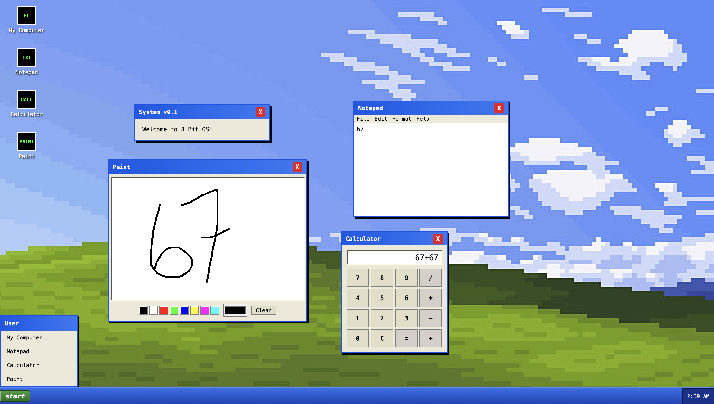

# 8 Bit OS

A retro Windows XP-styled OS that runs entirely in your browser.

**[Try it live →](https://8-bit-os.vercel.app)**

## Quick start

Open the link above. That's it.

## Features

- Boots into a Windows XP-style welcome screen
- Desktop with draggable, closable windows (drag by the title bar)
- Notepad for jotting text
- Calculator that does real arithmetic
- Paint app with a canvas, color picker, and preset swatches

## Run it locally

plain HTML/CSS/JS.

git clone https://github.com/raiyan-islam-dev/8-Bit-OS.git
cd 8-Bit-OS
open index.html

## How it works

- **Draggable Windows:** Tracks mouse clicks on the top bar to move windows around the screen.
- **Calculator:** Uses standard JS evaluation to do math directly from the button inputs.
- **Paint App:** Uses HTML Canvas to draw smooth lines wherever you move your mouse.

## Credits

Built for Hack Club's Stardance WebOS1 mission. Color palette references the Windows XP Luna theme.

## AI Declaration

AI was used for code debugging and polishing documentation.